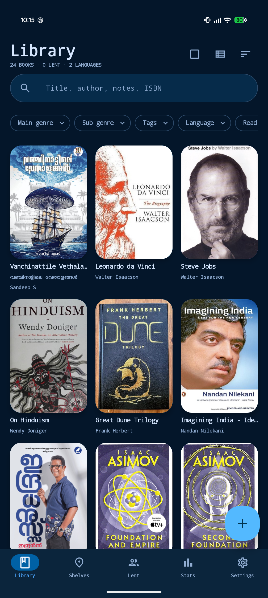
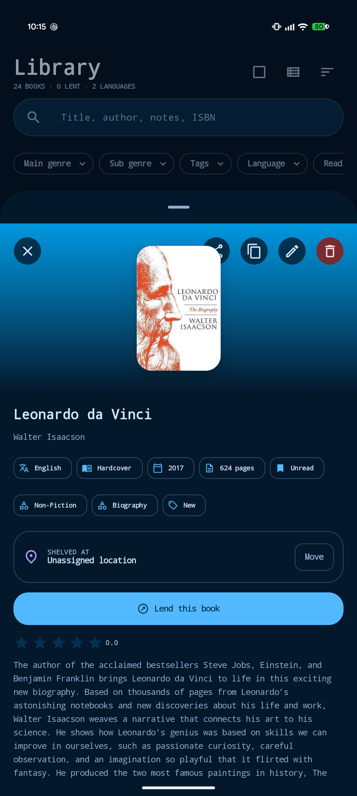
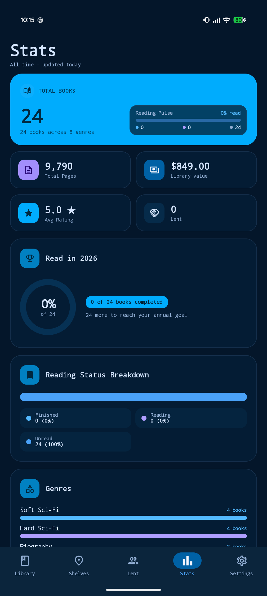

<div align="center">

# Home Library

**A place for every book. A library in your pocket.**

Catalog your collection, find books on your shelves, and keep track of the ones you lend.


[](https://github.com/rjwarrier/Home-Library/releases/tag/v0.90b)

[Download APK](https://github.com/rjwarrier/Home-Library/releases/download/v0.90b/Home-Library-0.90b.apk) · [Releases](https://github.com/rjwarrier/Home-Library/releases) · [Report a bug](https://github.com/rjwarrier/Home-Library/issues)

</div>

---

## Overview

Home Library is a native Android app built with Kotlin and Jetpack Compose for managing a personal book collection. Keep your catalog, physical shelf locations, reading details, and loans together, with local backup and export tools.

## Screenshots

Captured on a Pixel 9 Pro XL in dark mode.

| Library | Book details | Statistics |
| :---: | :---: | :---: |
|  |  |  |

## Features

- **Build your catalog** — add books, scan ISBN barcodes, and look up book metadata.
- **Find the right shelf** — organize books by room, bookcase, and shelf, with position notes.
- **Make it personal** — record reading status, ratings, tags, notes, and quotes.
- **Track loans** — manage borrowers and get loan reminders.
- **Choose your covers** — use ISBN cover suggestions, pick and crop a file, or search for an image inside the app. Saved covers remain available offline.
- **Keep a backup** — back up and restore your library, import or export CSV, and set backup reminders.
- **Share your catalog locally** — allow compatible apps signed with the same key to read selected catalog fields through an Android content provider.

## Install

1. Download **[Home-Library-0.90b.apk](https://github.com/rjwarrier/Home-Library/releases/download/v0.90b/Home-Library-0.90b.apk)** on an Android device running **Android 8.0 or later**.
2. Open the APK and allow installation from your browser or file manager if Android asks.
3. Launch **Home Library** and add your first book.

The release includes a `SHA256SUMS.txt` file for verifying the download.

> [!NOTE]
> **0.90b is a beta**, with version code `1`. The signed APK includes local workspace changes that are not in the release tag's source archive. See the [release notes](https://github.com/rjwarrier/Home-Library/releases/tag/v0.90b) for build provenance and validation details.

## Data and permissions

Your catalog is stored locally using Room. Online metadata lookup and cover searches need an internet connection; downloaded covers are stored locally for offline use.

| Permission | Purpose |
| --- | --- |
| Camera | Scan books and barcodes. Camera hardware is optional. |
| Internet | Look up metadata and browse or download cover images. |
| Notifications | Show loan and backup reminders. |

Android backup rules include the app database and saved covers. System backup and device transfer depend on your Android settings.

Catalog sharing is enabled by default and can be switched off under **Settings → Library preferences → Share catalog with other apps**. Access is restricted to apps signed with the same signing key. Loans, borrower details, notes, costs, purchase dates, signed-copy flags, and quotes are excluded from the shared catalog.

## Build from source

### Requirements

- JDK **17**
- Android SDK **36** and Android SDK Platform-Tools
- Android Studio, or a command-line Android SDK installation

Clone the repository:

```sh
git clone https://github.com/rjwarrier/Home-Library.git
cd Home-Library
```

Configure the Android SDK location in `local.properties` (`sdk.dir=...`), or let Android Studio create it.

### Debug build

On Windows:

```powershell
.\gradlew.bat :app:assembleDebug
```

On macOS or Linux:

```sh
bash ./gradlew :app:assembleDebug
```

The debug APK is written to:

```text
.out-redesign/app-build/outputs/apk/debug/app-debug.apk
```

### Tests and release build

```powershell
.\gradlew.bat :app:testDebugUnitTest
.\gradlew.bat :app:assembleRelease
```

Use `bash ./gradlew` in place of `.\gradlew.bat` on macOS or Linux. The release build enables code minification and resource shrinking. Signing credentials are not included in the repository, so `assembleRelease` produces an **unsigned** APK that must be signed before installation or distribution.

Build outputs default to `.out-redesign/`. Override the location with `-PhomeLibraryBuildRoot=<path>` if needed. On Windows, keep this directory on the **same drive as the project** because KSP/Room resolves generated paths relative to the source tree.

## Project structure

```text
app/src/main/
├── java/com/mj/homelibrary/
│   ├── catalog/       # Read-only inter-app catalog provider
│   ├── data/          # Room database, repositories, backup and cover storage
│   │   └── remote/    # Book lookup and OCR support
│   ├── ui/            # Compose screens and view model
│   │   └── theme/     # App theme and motion
│   └── worker/        # Loan and backup reminders
└── res/               # Strings, themes and Android resources
app/src/test/          # Unit and Robolectric tests
app/schemas/           # Room database schema history
```

The Android application ID is `com.mj.homelibrary`. User-visible text lives in Android string resources; translations can be added in locale-specific `res/values-*` directories.

## Cover image search

In the book editor, choose **Search cover images**, open an image preview or its source, and long-press the image. Confirm **Use this image as the cover?**, then **Save** the book to apply it. Some sites prevent selection or require authentication; try another source if an image cannot be downloaded.

<details>
<summary>Implementation details and manual verification</summary>


The browser uses Android WebView image hit testing and image download events, without a JavaScript bridge. It selects the actual exposed image source; Google thumbnails are not assumed to be full-resolution images. Public HTTPS and Base64 JPEG/PNG/WebP sources are supported. Some sites prevent selection, require authentication or block downloads; select another source in those cases.

Downloads run off the UI thread, with 15-second connection/read timeouts, three redirects maximum, a 10 MiB byte limit, and an 80-million-pixel limit. Validated DNS addresses are used for connections; private/reserved destinations, credentials, non-HTTPS URLs and non-443 ports are rejected. Cookies follow only the original image host. Covers are saved as relative `covers/<UUID>.<format>` paths, optionally compacted at quality 85 to a longest edge of 1,200 pixels, and remain available offline. Book/location updates are transactional; old files are removed only after successful attachment and when unreferenced. Discarded form downloads and temporary files are cleaned up.

Validation: `./gradlew.bat :app:testDebugUnitTest :app:assembleDebug`. On-device checks: open search from an existing book, select both a linked image and an unlinked image, cancel a download, navigate back/close, save and reopen offline, and dismiss an edited form without saving. Verify Google consent pages and source sites on the installed WebView version; their behavior can vary.

</details>

## Sharing the catalog

Home Library exposes a **read-only** `ContentProvider` so other apps on the same phone (for example the Vayana reader) can keep a synced copy of the catalog. Home Library owns the data; nothing can be written back through the provider (`insert`, `update` and `delete` throw `UnsupportedOperationException`).

| | |
| --- | --- |
| Authority | `com.mj.homelibrary.catalog` |
| Permission | `com.mj.homelibrary.permission.READ_CATALOG` (`signature`: granted automatically to apps signed with the same key as Home Library, no prompt; every other app is denied) |
| Switch | Settings > Library preferences > "Share catalog with other apps" (default on). When off, every query returns an empty cursor and covers are not served. |

### URIs

- `content://com.mj.homelibrary.catalog/books` and `.../books?updated_since=<epochMillis>&limit=<n>`: books with `updated_at > updated_since` (all books when omitted), plus deletion tombstones with `deleted_at > updated_since`. Sorted by `updated_at` ascending. Tombstones are kept for 90 days.
- `content://com.mj.homelibrary.catalog/books/<sync_uuid>/cover`: `openFile(uri, "r")` returns the cover image; `FileNotFoundException` if the book has no cover.
- `content://com.mj.homelibrary.catalog/info`: one row with `schema_version` (1), `book_count`, `max_updated_at`, `app_version`.

Observe `content://com.mj.homelibrary.catalog/books` with a `ContentObserver` to refresh while both apps run (notifications are sent at most once per second).

### Columns of `/books`

All TEXT unless noted. A **tombstone** row has `deleted = 1`, `updated_at` = deletion time, and `NULL` in every column except `sync_uuid`, `deleted` and `updated_at`.

`sync_uuid`, `deleted` (INTEGER 0/1), `updated_at` (INTEGER millis), `title`, `subtitle`, `original_script_title`, `authors` (names separated by `"; "`), `language_code`, `isbn13`, `isbn10`, `publisher`, `published_year` (INTEGER), `page_count` (INTEGER), `format_code`, `series_name`, `main_genre`, `sub_genres` (JSON array of strings), `tags` (JSON array of strings), `read_status_code`, `rating` (REAL, nullable), `room`, `bookcase`, `shelf`, `position_note`, `has_cover` (INTEGER 0/1).

### Identity and change tracking

- `sync_uuid` is a UUID v4 generated once per book. It never changes and is kept by backup restore and CSV round trips, so readers match books on it.
- `updated_at` changes whenever the book changes, and when its room, bookcase or shelf is renamed, moved or deleted.
- The `info` row's `schema_version` only changes on breaking changes to this contract; new columns may be appended.

### Privacy

Never exposed: loans, borrowers (names, phones, relations), notes, cost, purchase date, signed-copy flag, quotes. A unit test fails if any of these appear in the provider's columns or values.

### Opening a book from another app

Start `MainActivity` with action `com.mj.homelibrary.action.SHOW_BOOK` and an extra `sync_uuid` (or `isbn13`). The book's detail screen opens; if it is not found, the library opens with a "Book not found" message.

## Contributing

Bug reports and focused improvements are welcome. Please [open an issue](https://github.com/rjwarrier/Home-Library/issues) with your Android version, app version, steps to reproduce, and expected behavior. Remove personal library or borrower details from screenshots and logs.

For code changes, describe the behavior you are changing and run the relevant tests and a debug build before opening a pull request.
